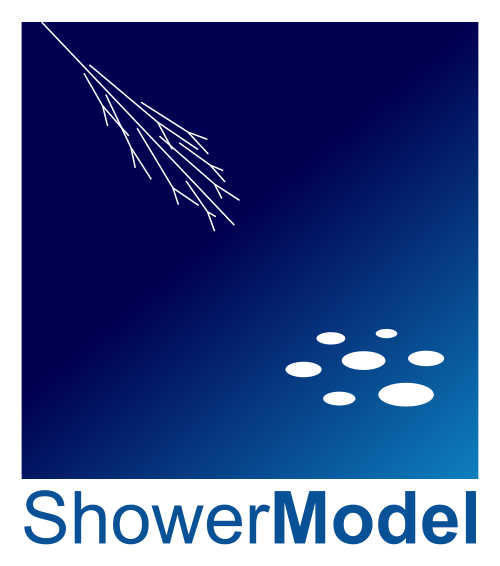

ShowerModel
=======================================

A Python package for modelling cosmic-ray showers, their light production and its detection.

* Code: https://github.com/JaimeRosado/ShowerModel/
* Docs: https://showermodel.readthedocs.io/
* License: BSD-3
* Python 3.7 or later

.. _showermodel_guide:
.. toctree::
    :maxdepth: 1
    :caption: Guide

    introduction
    tutorials/index
    package/package
    bibliography

Indices and tables
==================

* :ref:`genindex`
* :ref:`modindex`
* :ref:`search`
